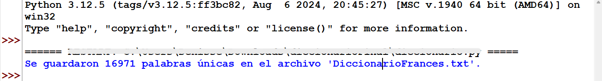
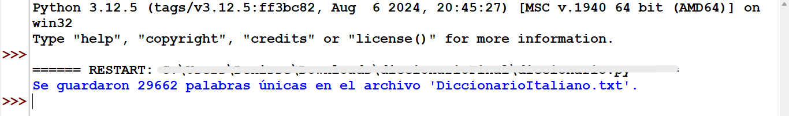
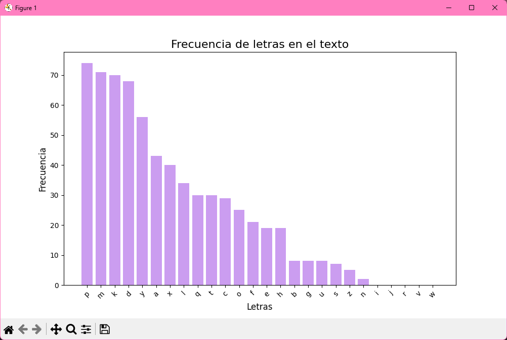
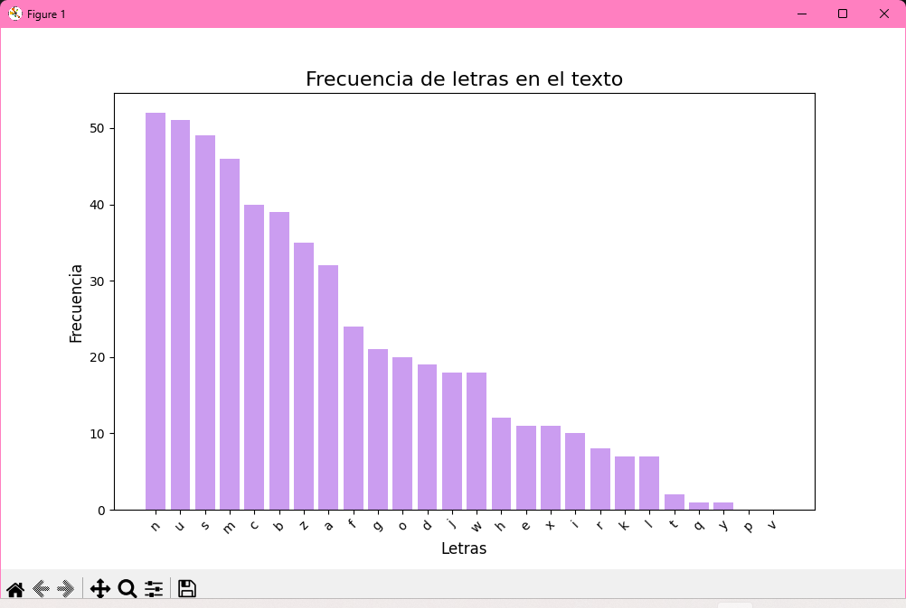
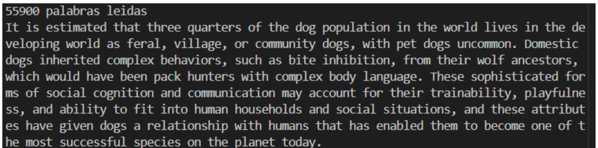
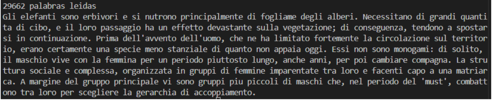

# ✨ DESCIFRAR TEXTO ✨

El proyecto se basó en la selección de un archivo específico. Una vez seleccionado, dicho archivo debía ser descifrado para acceder a su contenido. Para ello, se tuvo en cuenta que el texto podía estar en inglés, italiano o francés.

Se indican diversas carpetas de acuerdo a los diversos pasos realizados para descifrar el texto. 

## Diccionario

Se creó un programa que *realiza la lectura de textos (en este caso, fueron libros) y genera un diccionario a partir de las palabras extraídas.* 

Para lograrlo, se procesa cada texto, una vez leídas las palabras se asegura que no se repitan y se convierten a minúsculas sin importar su forma original. También se encarga de eliminar cualquier signo de puntuación, como comas, puntos, signos de interrogación, exclamación, así como los números. De este modo, se obtiene un diccionario, que cumple con las condiciones requeridas. 

En el proyecto, se solicitó la creación de dos diccionarios. Los diccionarios generados son en formato de texto, ***“DiccionarioFrances.txt"*** y ***“DiccionarioItaliano.txt”*** ambos se muestran en la carpeta **'diccionariosGenerados'**.

### Resultados de terminal

## Histograma

El programa realizado lee los textos asignados, con el objetivo de *generar un histograma que muestra la frecuencia de las letras*. Las letras se grafican de tal manera que se ordenen desde la más repetida hasta la menos repetida, lo que permite hacer una suposición sobre el posible idioma del texto indicado. Igualmente, el programa proporciona a la salida un ***.csv*** que recaba la frecuencia de las letras de cada texto. 

Al realizar la comparación de los histogramas, la frecuencia obtenida en la gráfica del texto uno y la del idioma **italiano** eran muy similares, por lo tanto, se intuye que ese es el idioma a trabajar. Para el segundo texto igual se comparó, lo que permitió intuir que el texto está en **inglés**. 

### TEXTO UNO: ITALIANO

### TEXTO DOS: INGLÉS 

> La comparación de frecuencia se realizó con la ayuda del mismo sitio, para la frecuencia de letras en 
[**inglés**](https://es.sttmedia.com/frecuencias-de-letras-ingles), [**francés**](https://es.sttmedia.com/frecuencias-de-letras-frances), [**italiano**](https://es.sttmedia.com/frecuencias-de-letras-italiano).

## Resultado final
Como última parte del proyecto, se reutilizó el mismo código para descifrar ambos textos, de tal forma que se obtuvieron los textos originales.

### Terminal de ambos programas

## Colaboradoras 👩🏼‍💻

El proyecto fue realizado para la materia de ***Diseño y análisis de algoritmos*** en la Facultad de Estudios Superiores Aragón durante el semestre **2025-I**.

🎀  Ariadna Denisse García Estrada **([ariadna-ge](https://github.com/ariadna-ge))**  
🎀 Alexandra Galilea González Arias **([Galilea44](https://github.com/Galilea44))**  
🎀 Pamela Ramírez Arevalo **([PomsArevalo](https://github.com/PomsArevalo))**  
